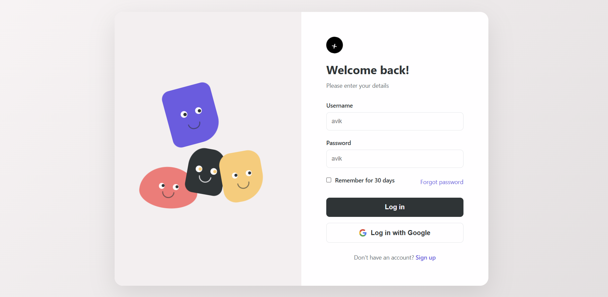
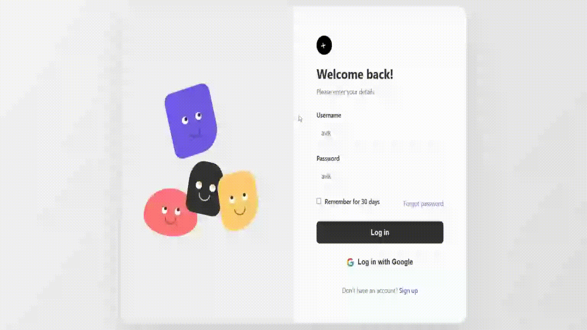
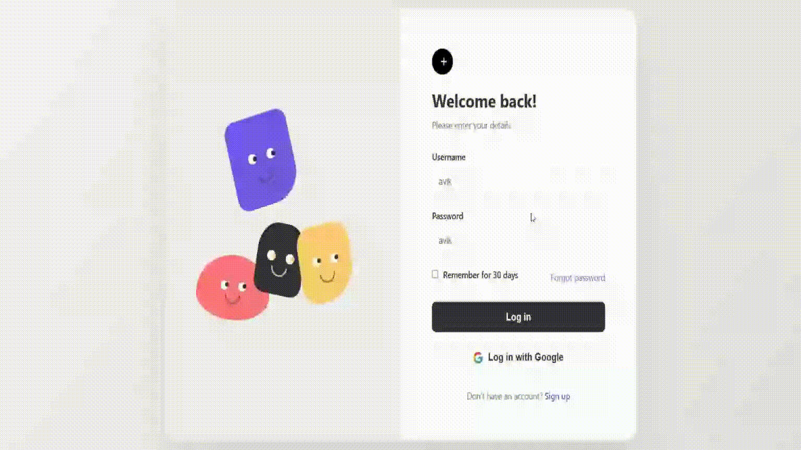

# 🎨 Animated Login Form

An interactive and playful login form with animated characters that respond to user interactions. The characters follow your cursor, tilt towards it, and react to login attempts with expressive animations.


## ✨ Features

### 🎭 Interactive Character Animations
- **Eye Tracking**: Character eyes follow your cursor movement in real-time
- **Character Tilting**: All characters subtly tilt towards your mouse cursor
- **Success Animation**: Characters nod up-down when login is successful
- **Error Animation**: Characters shake left-right when credentials are incorrect
- **Floating Effect**: Characters continuously float up and down

### 🔐 Login Functionality
- Username and password validation
- Visual error feedback with red borders
- Error messages for incorrect credentials
- Smooth input field animations
- "Remember me" checkbox
- "Forgot password" link
- Google Sign-in button (UI only)

### 🎨 Design Features
- Modern, clean UI design
- Responsive layout (works on mobile and desktop)
- Smooth transitions and animations
- Color-coded error states
- Professional typography

## 📸 Screenshots

### Login Screen


### Eye Tracking


### Success Animation


### Error Animation


## 🚀 Demo

**Test Credentials:**
- Username: `avik`
- Password: `avik`

Try entering wrong credentials to see the shake animation, or correct credentials to see the nod animation!

## 🛠️ Technologies Used

- **HTML5** - Structure
- **CSS3** - Styling and animations
- **Vanilla JavaScript** - Interactivity and logic
- **No dependencies** - Pure frontend implementation

## 📦 Installation

1. Clone the repository:
```bash
git clone https://github.com/Avikg/Animated-Login-Form.git
```

2. Navigate to the project directory:
```bash
cd Animated-Login-Form
```

3. Open `login_form.html` in your browser:
```bash
# On macOS
open login_form.html

# On Windows
start login_form.html

# On Linux
xdg-open login_form.html
```

Or simply drag and drop the `index.html` file into your browser.

## 📂 Project Structure

```
Animated-Login-Form/
├── login_form.html          # Main HTML file with embedded CSS and JS
├── screenshots/        # Screenshots and GIFs for README
│   ├── demo.png
│   ├── login-screen.png
│   ├── eye-tracking.gif
│   ├── success-animation.gif
│   └── error-animation.gif
└── README.md          # Project documentation
```

## 🎯 How It Works

### Eye Tracking Algorithm
```javascript
// Calculates angle and distance between cursor and eye center
const deltaX = e.clientX - eyeCenterX;
const deltaY = e.clientY - eyeCenterY;
const angle = Math.atan2(deltaY, deltaX);
const distance = Math.min(5, Math.sqrt(deltaX * deltaX + deltaY * deltaY) / 20);
```

### Character Tilting
```javascript
// Characters tilt up to 8 degrees towards cursor
const maxTilt = 8;
const tiltX = (deltaX / window.innerWidth) * maxTilt;
shape.style.transform = `rotate(${tiltX}deg)`;
```

### Animation States
- **Float**: Continuous up-down movement (3-3.5s cycles)
- **Tilt**: Real-time cursor following (0.1s transition)
- **Shake**: Horizontal shake with rotation on error (0.8s)
- **Nod**: Vertical bounce on success (1s)

## 🎨 Customization

### Change Colors
Modify the character colors in CSS:
```css
.shape-purple { background: #6C5CE7; }
.shape-orange { background: #FF7675; }
.shape-black { background: #2D3436; }
.shape-yellow { background: #FDCB6E; }
```

### Adjust Animation Speed
```css
.shape-purple { animation: float 3s ease-in-out infinite; }
/* Change 3s to your preferred duration */
```

### Update Credentials
Modify the credentials in JavaScript:
```javascript
const CORRECT_USERNAME = 'avik';
const CORRECT_PASSWORD = 'avik';
```

## 🌟 Key Animations

| Animation | Trigger | Duration | Effect |
|-----------|---------|----------|--------|
| Float | Always active | 3-3.5s | Gentle up-down motion |
| Eye Tracking | Cursor movement | Real-time | Pupils follow cursor |
| Character Tilt | Cursor movement | 0.1s | Body tilts toward cursor |
| Shake | Wrong credentials | 0.8s | Left-right shake (NO gesture) |
| Nod | Correct credentials | 1s | Up-down bounce (YES gesture) |

## 📱 Responsive Design

The form is fully responsive and adapts to different screen sizes:
- **Desktop**: Side-by-side layout (characters + form)
- **Mobile**: Stacked layout (characters on top, form below)

## 🤝 Contributing

Contributions are welcome! Here's how you can help:

1. Fork the repository
2. Create a new branch (`git checkout -b feature/improvement`)
3. Make your changes
4. Commit your changes (`git commit -am 'Add new feature'`)
5. Push to the branch (`git push origin feature/improvement`)
6. Create a Pull Request

## 📝 Future Enhancements

- [ ] Add actual Google OAuth integration
- [ ] Implement password strength indicator
- [ ] Add more character expressions (happy, sad, surprised)
- [ ] Sound effects for animations
- [ ] Dark mode toggle
- [ ] Multiple language support
- [ ] Accessibility improvements (ARIA labels)
- [ ] Backend integration for real authentication

## 📄 License

This project is licensed under the MIT License - see the [LICENSE](LICENSE) file for details.

## 👤 Author

**Avik**
- GitHub: [@Avikg](https://github.com/Avikg)
- LinkedIn: [Avik Pramanick](https://linkedin.com/in/yourprofile](https://www.linkedin.com/in/avik-iitian/)
- Email: your.email@example.com

## 🙏 Acknowledgments

- Inspired by modern UI/UX design trends
- Character design concept from creative login interfaces
- Animation techniques from CSS animation best practices

## 📊 Browser Support

| Browser | Supported |
|---------|-----------|
| Chrome | ✅ Yes |
| Firefox | ✅ Yes |
| Safari | ✅ Yes |
| Edge | ✅ Yes |
| Opera | ✅ Yes |
| IE 11 | ❌ No |

---

⭐ If you found this project helpful, please consider giving it a star!

💬 Have questions or suggestions? Feel free to open an issue or reach out!
